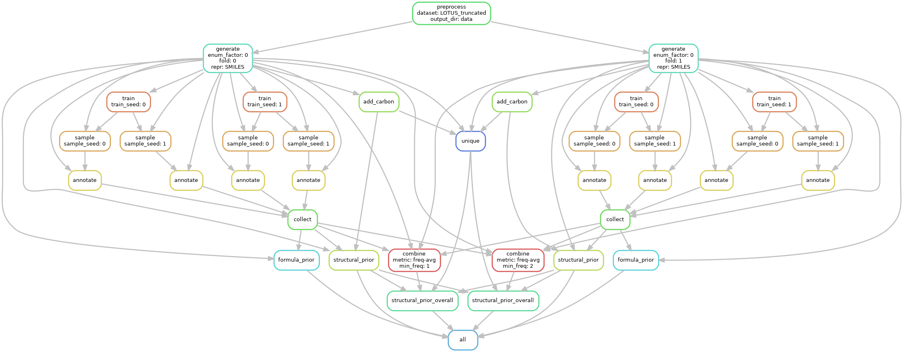

## Snakemake workflow

The included `Snakefile` provides a way to run the end-end workflow for the
`clm` repository.

The following "rulegraph" illustrates the unique steps in the workflow that would be run,
and their order of execution.


Note that the actual number of jobs will exceed the number of rules above, since many different
instances of the rules will be run for any given dataset, depending on the number of train/test folds,
the number of independent seeds against which to run the models etc.

The following dependency graph illustrates the particular instances of the steps that would be run, when
running the workflow for a single `enum_factor`, 3 `folds`, 2 `training seeds`, and 1 `sampling seed`.
(This is the starter configuration provided in the file `config_fast.json`).




### Testing the workflow

To run this workflow on a tiny dataset provided with `clm`:

#### Steps

1. Clone the repository, install `clm` to get all the dependencies, including `snakemake`.
```
git clone ..
cd CLM
pip install -e ".[dev]"
```

2. `cd` to the `snakemake/` folder and run the following command to see the steps (including the actual commands) that will be run:

```
cd CLM/snakemake
snakemake --configfile config_fast.json --jobs 1 --dry-run -p
```

3. Repeat the command without the `--dry-run -p` to execute the workflow. The end-end workflow should take around 5 minutes on computers where `torch` has access to a gpu, or 20-25 minutes otherwise.

Note that the configuration provided in `config_fast.json`, as well as the truncated datasets that it uses by default, are purely for software testing purposes, and generate results/graphs that are not interpretable. To run the actual workflow on your dataset, read on.

### Running the "real" workflow

To run the end-end workflow on an actual dataset (preferably on a cluster), repeat the above process, but with a few tweaks:

#### Steps

a. Specify the paths to your dataset (a `.txt` file containing SMILES in each line), as well as the [PubChem]() dataset. (link coming soon), as `--config` parameters on the command line.

b. Add the `--slurm` flag to indicate that the steps should be run using `sbatch`.

c. Replace `--configfile config_fast.json` with `--configfile config.json` (or eliminate this flag altogether).

d. Make any other configuration changes in `config.json` (network architecture, number of epochs, other hyperparameters).

e. Increase the value of the `--jobs` flag to specify the maximum number of slurm jobs to run at a time.

Run the following command to see the steps (including the actual commands) that will be run:

```
snakemake --config dataset=/path/to/dataset.txt pubchem_tsv_file=/path/to/PubChem.tsv --jobs 10 --dry-run -p
```

Replace `dataset` and `pubchem_tsv_file` with the paths to your dataset file and PubChem tsv file respectively. These will override the
values obtained for these flags in `config.json`. Alternately, you can change `config.json` to point to the correct paths.

Repeat the command without the `--dry-run -p` to execute the workflow. The end-end workflow should take around 24 hours, depending on the cluster workload and the exact configuration in `config.json`.

```
snakemake --config dataset=/path/to/dataset.txt pubchem_tsv_file=/path/to/PubChem.tsv --jobs 10 &
```

> Note that running `snakemake` in a foreground process will run the workflow in blocking mode. Though actual jobs will be submitted to compute nodes, pressing
Ctrl-C will cause `snakemake` to attempt to cancel pending/currently running jobs (through `scancel`). You should thus run the actual workflow in the background
using `&`, or use an environment like [tmux](https://github.com/tmux/tmux/wiki/Getting-Started) that you can attach to and detach from on demand.


### Other useful commands

To generate the Rule graph that you see above:
```
snakemake --configfile .. --forceall --rulegraph | dot -Tpng > rulegraph.png
```

To generate the DAG dependency graph that you see above:
```
snakemake --configfile .. --forceall --dag | dot -Tpng > dag.png
```
